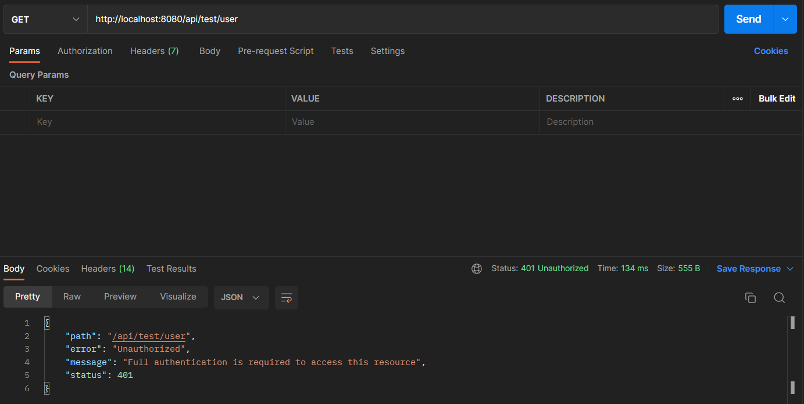
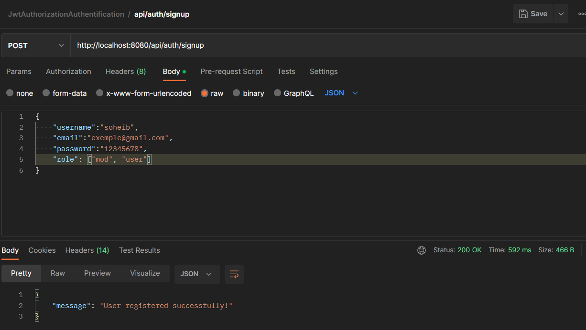
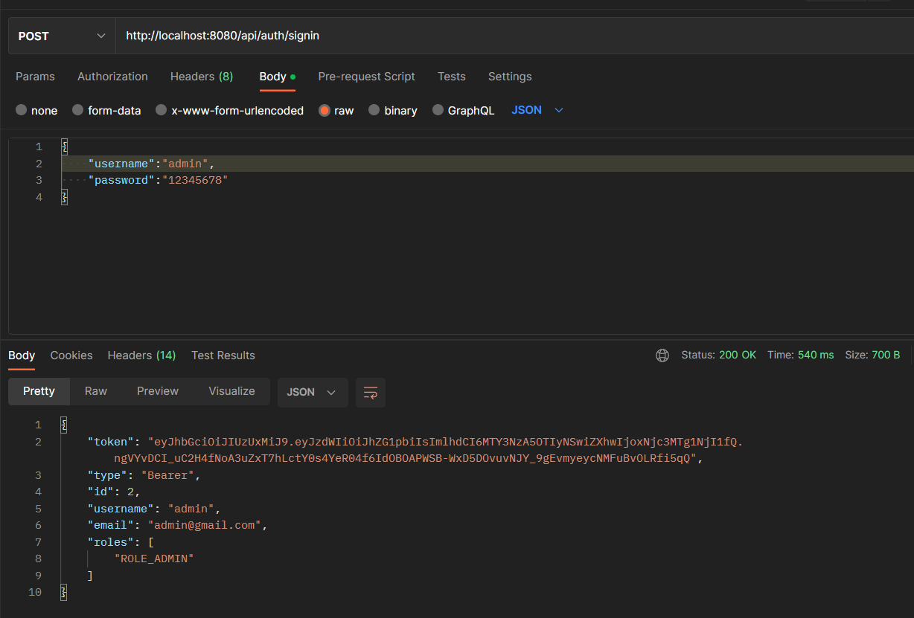
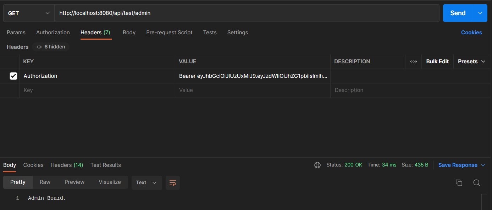
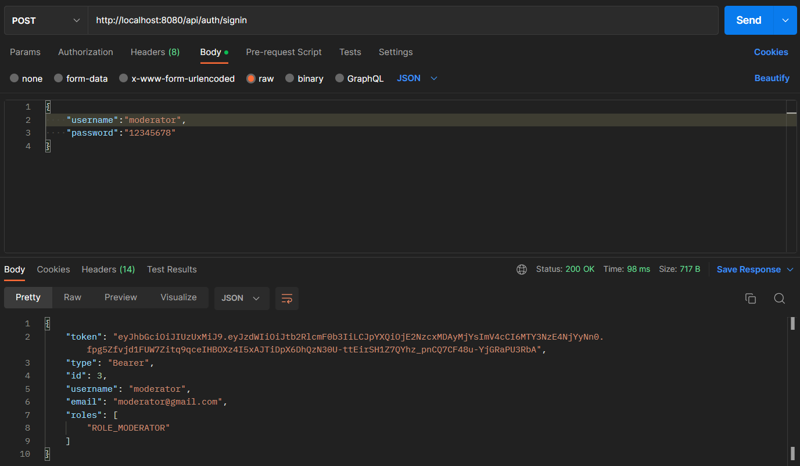
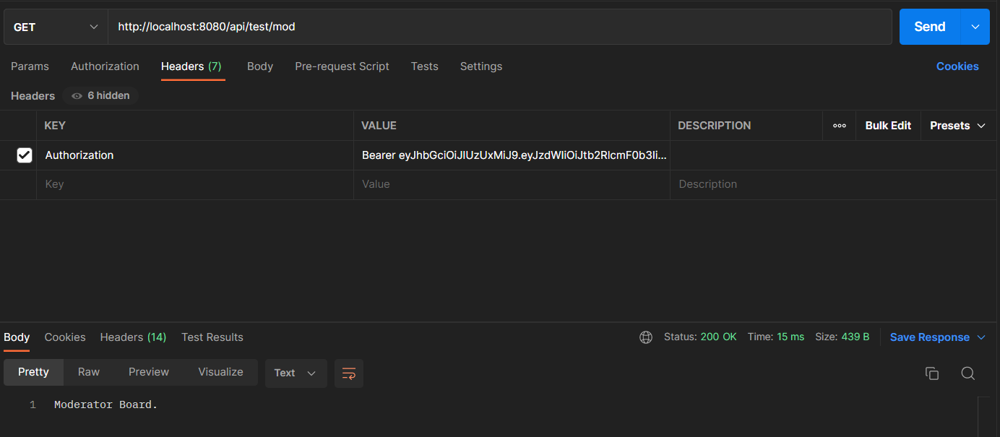

## Spring Boot JWT Authentication and Authorization using Spring Security Spring Data JPA  

### Run the following SQL statements 
```
insert into Roles (id, name) values (1,'ROLE_USER');
insert into Roles (id, name) values (2,'ROLE_MODERATOR');
insert into Roles (id, name) values (3,'ROLE_ADMIN');
```

### Access protected resource " api / test / user "



### Register User " api / auth / signup "

- user <b>admin</b> with ROLE_ADMIN
- user <b> moderator </b> with ROLE_MODERATOR
- user <b> soheib </b> with ROLE_USER 



### Signin with admin user " api / auth / signin"



### Access " / api / test / admin "



### Signin with moderator user " api / auth / signin"




### Access " api / test / mod"
